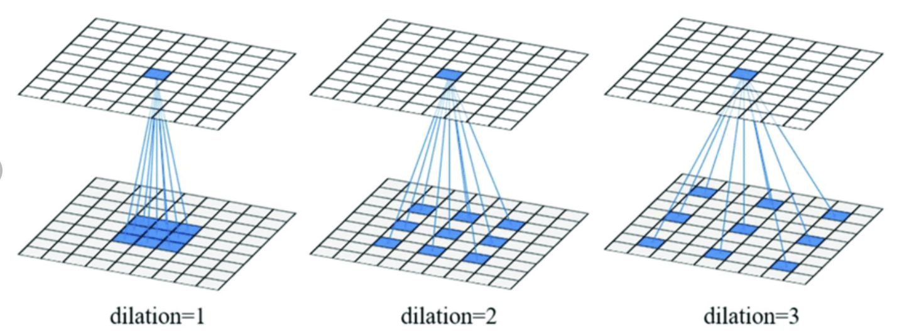

# This article talks about training CIFAR 10 dataset

This file is submitted as part of Assignment 7 for EVA6 Course

**Highlights**
* We will train a CNN from scratch to achieve an accuray of **87.6%**, with just **55.8k** Params
* Use different techniques like **CutOut**, **RICAP** and show a comparison on how they improve on accuracy
* We will design a model arcitecture from scratch using **ResnetBlocks**
* Compare techniques like **Strided Convolution**, **Dilated Convolution**
* All of this is supported by code atttached

### Table of Contents

* [Contributors](#Contributors)
* [Model Architecture](#Model-Architecture)
* [Convolution Techniques Explained](#Convolution-Techniques-Explained)
* [Transformations and Albumentations](#Transformations-and-Albumentations)
* [Graphs](#Graphs)
* [Visualization for misclassified predictions](#Visualization-for-misclassified-predictions)
* [Code Explanation](#Code-Explanation)
* [References](#References)

### Contributors

* [Ammar Adil](https://github.com/adilsammar)
* [Krithiga](https://github.com/BottleSpink)
* [Shashwat Dhanraaj](https://github.com/sdhanraaj12)
* [Srikanth Kandarp](https://github.com/Srikanth-Kandarp)


### Model Architecture

**Overview:**

* Model architecture used here is highly isnpired with residual blocks
* Using Strides and Dilations to reduce channel sizes instead of max polling

Deep Learning harnesses the power of Big Data by building deep neural architectures that try to approximate a function _f(x)_ that can map an input, _x_ to its corresponding label, _y_. **The Universal Approximation Theorem** states that it is possible for a feedforward network with a single layer to closely approximate any function over a domain, provided the layer has enough neurons/hidden units. However, in practice, _deeper_ L-layer neural networks with a smaller number of hidden units per layer are capable of closely approximating a function that shallower layers require exponentially more hidden units to compute.

The true power of Deep Learning lies in the ability to capture abstract features as the signal moves deeper into the layers. However, deeper neural networks often become victim to the notorious vanishing/exploding gradients and performance degradation problem

To overcome this problem, **He et al (2015)** devised a **Deep Residual architecture**. With a depth of up to 152 layers, the model was able to achieve an error of **3.57%** on the ImageNet test. The architecture is known as the **_ResNet_** and is a stack of *‘Residual Blocks’*.

**Residual Block**

A residual block is a stack of layers set in such a way that the output of a layer is taken and added to another layer deeper in the block. The non-linearity is then applied after adding it together with the output of the corresponding layer in the main path. This by-pass connection is known as the shortcut or the skip-connection.

<p float="left">
    <image src='assets/residual_block.png' height='150'>
    <image src='assets/formula.png' height='150'>
</p>

For a residual block with a skip-connection from layer, l to l+2, the activation for layer l+2 is computed as shown above.

**Residual Networks**

A residual network is formed by stacking several residual blocks together. Figure 1, showed that with deeper neural networks, the training error tends to increase. However, deep ResNets are capable of forming an identity function that maps to an activation earlier in the network when a specific layer’s activation tends to zero deeper in the network.

<p float="left">
    <image src='assets/residual_network.png' height='150'>
    <image src='assets/rn_formula.png' height='150'>
</p>

In the above equation, let g be the ReLU activation function. If the activations for the layer _l+2_ tends to _0_, This identity mapping created by these residual blocks is the reason why the addition of extra layers does not affect a residual network’s performance. Performance improvement is achieved whenever the extra layers learn some meaningful information from the data. While, the presence of the residual blocks prevents the loss of performance whenever, the activations tend to vanish or explode.

It is worth mentioning, that for this technique to work the dimension of _z[l+2]_ and _a[l]_ should be similar as they need to be summed up. Depending on dimension of _z[l+2]_ and _a[l]_, there are two kinds of residual blocks

**A. Identical residual block**

In an identical residual block, the output of the shortcut path and the main path is of the same dimensions. This is achieved by padding the input to each convolutional layer in the main path in such a way that the output and input dimensions remain the same.

<image src='assets/identical_residual_block.png' height='150'>

**B. Convolutional residual block**

In this type of residual block, the skip-connection consists of a convolutional layer to resize the output of the shortcut path to be of the same dimension as that of the main path. The layer can also make use of different filter sizes, including 1×1, padding, and strides to control the dimension of the output volume. The convolutional layer does not apply any non-linear function and the main role is to apply a learned linear function that reduces the dimension of the input.

<image src='assets/conv_residual_block.png' height='150'>

### Convolution Techniques Explained

* Dilated Convolution

#### What is Dilated Convolution?  

 > In dilated convolution, we systematically aggregate multiscale contextual information without losing resolution. The dilated convolution operator has been referred to in the past as “convolution with a dilated filter”. We use the term “dilated convolution” instead of “convolution with a dilated filter” to clarify that no “dilated filter” is constructed or represented. The dilated convolution operator can apply the same filter at different ranges using different dilation factors.

#### How is it different from standard convolution?  

 > Dilated convolution is just a convolution applied to input with defined gaps. 


where 

> F, a discrete function,<br>
> k, filter size of (2r+1)/^2 <br>
> \*, discrete convolution operator <br>
> l, a dilation factor

> When \*l\*=1, it is standard convolution. <br>
> When \*l\*>1, it is dilated convolution. <br>




#### Why do we need dilated convolution? 

  > Dilated Convolution is specifically designed for dense prediction. Dilated convolutions supports exponential expansion of the receptive field without loss of resolution or coverage 

#### Usecases/ scenarios where dilated convolution will be of major help?

>  1. Detection of fine-details by processing inputs in higher resolutions. <br>
>  2. Broader view of the input to capture more contextual information. <br>
>  3. Faster run-time with less parameters 

Is this similar to pooling or strided convolutions? 

  > In a way, but here the output has the same size as the input. As a special case, dilated convolution with dilation 1 yields the standard convolution. 

#### Where else the dilated convolution is used?

  > Wavenet: Dilated convolutions are to increase the receptive field by orders of magnitude, without greatly increasing computational cost.</P>

Receptive Field Calculation:

  > Dilated (atrous) convolution.** Dilations introduce “holes” in a convolutional kernel. While the number of weights in the kernel is unchanged, they are no longer applied to spatially adjacent samples. Dilating a kernel by a factor of αα introduces striding of αα between the samples used when computing the convolution. This means that the spatial span of the kernel (k>0k>0) is increased to α(k−1)+1α(k−1)+1. The above derivations can be reused by simply replacing the kernel size kk by α(k−1)+1α(k−1)+1 for all layers using dilations. </P>

* Depthwise Separable Convolution

#### Problem with standard convolution:

> Traditional convolutions yield good performance, but require many computational resources. For example, one convolutional layer trained on 15x15x3 pixel images will already require more than 45000 multiplications to be made… per image!

#### Spatially separable convolutions:

>help solve this problem. They are convolutions that can be separated across their spatial axis, meaning that one large convolution (e.g. the original Conv layer) can be split into smaller ones that when convolved sequentially produce the same result. By consequence, the number of multiplications goes down, while getting the same result

The downside of these convolutions is that they cannot be used everywhere since only a minority of kernels is spatially separable. To the rescue here are **depthwise separable convolutions**. This technique simply splits convolutions differently, over a depthwise convolution and a pointwise convolution. The depthwise convolution applies the kernel to each individual channel layer only. The pointwise convolution then convolves over all channels at once, but only with a 1×1 kernel. 

Insert Depthwise Png

### Transformations and Albumentations

Lets now talk about different albumentation libraries used

#### Introduction

**Why Albumentation?** Albumentations is a Python library for image augmentations that helps boosts the performance of deep convolutional neural networks with less data. As they efficiently implements variety of image transform operations that optimized the performance of our model.

**Now lets let's see what all augumentation techniques we have used in our model in detailed,**

#### Horizontal Flip
This technique flips the input horizontally around the y-axis.
  
**Syntax**
```
class albumentations.augmentations.transforms.HorizontalFlip(always_apply=False, p=0.5)
```

Where Argumens is 

* Parameter(p) is probability of applying the transform which is by default "0". 

The final targets would be an image or Mask or Bboxes with type of the image being uint8 or float32.

#### Shift Scale Rotate
This technique randomly apply affine transforms which are translate, scale and rotate the input.

**Syntax**
```
class albumentations.augmentations.transforms.ShiftScaleRotate(shift_limit=0.0625, scale_limit=0.1, rotate_limit=45, interpolation=1, border_mode=4, always_apply=False, p=0.5)

```
Where Arguments are,

* Shift limit is a (float,float) or can also be a single float value which is the shift factor range for both height and width. If shift_limit is a single float value, the range will be (-shift_limit, shift_limit). Absolute values for lower and upper bounds should lie in range [0, 1] and default being "0.0625".
* Scale limit is a (float, float) or can also be a single float value which is the scaling factor range. If scale_limit is a single float value, the range will be (-scale_limit, scale_limit) and default being "0.1".
* Rotate limit is a (int, int) or can also be a single int value which is the rotation range. If rotate_limit is a single int value, the range will be (-rotate_limit, rotate_limit)and default being "45".
* Interpolation is a flag that is used to specify the interpolation algorithm and that can be one of these all below and default being "INTER_LINEAR",
    1. INTER_NEAREST,
    2. INTER_LINEAR
    3. INTER_CUBIC
    4. INTER_AREA
    5. INTER_LANCZOS4
* Border Mode is a flag that is used to specify the pixel extrapolation method and that can be one of these all below and default being "BORDER_REFLECT_101",
    1. BORDER_REFLECT_101
    2. BORDER_REPLICATE
    3. BORDER_REFLECT
    4. BORDER_WRAP
    5. BORDER_REFLECT_101
* Just like for Horizontal Flip Parameter(p) is probability of applying the transform which is by default "0" .

The final targets would be an Image or Mask with Type of the Image being uint8 or float32.


#### Coarse Dropout
This technique helps train the rectangular regions in the image.

**Syntax** 
```
class albumentations.augmentations.transforms.CoarseDropout (max_holes=8, max_height=8, max_width=8, min_holes=null, min_height=null, min_width=null, fill_value=0, mask_fill_value=null, always_apply=False, p=0.5)
```
Where Arguments are,

* Max Holes is a int value and it is used to declare the maximum number of regions to zero out.
* Max Height is a int Value and it is used to set the maximum height of the hole.
* Max Width is a int Value and it is used to set the maximum width of the hole.
* Min Holes is a int value and it is used to declare minimum number of regions to zero out and if the value is null then Min Holes is be set to  value of max_holes if not then default is null.
* Min Height is a int value and it is used to set the minimum height of the hole and if the value is null then Max Height is be set to value of Max Height if not then default is null.
* Min Width is a int value and it is used to set the minimum height of the hole and if the value is null then Max Width is be set to value of Max Width if not then default is null .
* Fill Value can be a int,float of list of int,float values that can be used to defind the dropped pixels.
* Mask Fill Value can be be a int,float of list of int,float values thae can be used to fill the value for dropped pixels in mask if the value is null then the mask won't be affected by default it is null

The final targets would be an Image or Mask with Type of the Image being uint8 or float32.

#### Grayscale
This technique helps to convert the input RGB image to grayscale. If the mean pixel value for the resulting image is greater than 127, invert the resulting grayscale image.

**Syntax**
```
class albumentations.augmentations.transforms.ToGray(always_apply=False, p=0.5)
```
Where Arguments are,
* Quality Lower is a float value and it is used to set the lower bound on the jpeg quality and the range should be [0, 100].
* Quality Upper is a float value and it is used to set the upper bound on the jpeg quality and the range should be [0, 100].

The final targets would be an Image with Type of the Image being uint8 or float32.

### Graphs

#### Using Cutout

* Case 1 : 85.31 accuracy 


   

* Case 2 : 87.31 accuracy 


   

#### Using Dilation

* Case 1 : 79.92 accuracy 


   

* Case 2 : 80.35 accuracy with Ricap
   

#### Using Ricap 

* Case 1 : 86.26 accuracy 


   

* Case 2 : 87.62 accuracy 


   


### Visualization for misclassified predictions

#### Using Cutout

* Case 1 : 85.31 accuracy 


   

* Case 1 : 85.31 accuracy 


   
   
#### Using Dilation

* Case 1 : 79.92 accuracy 


   

   * Confusion Matrix 
  
      

* Case 2 : 80.35 accuracy using Ricap 


   

   * Confusion Matrix 
  
      

#### Using Ricap 

* Case 1 : 86.26 accuracy 


   

   * Confusion Matrix with 1374 total incorrect predictions 
  
      

* Case 2 : 87.62 accuracy 


   
   
   * Confusion Matrix with 1238 total incorrect predictions 
  
      


### Code Explanation

The codebase has been modularized and we have kept the below in separate .py files

* [Dataset loader:](https://github.com/adilsammar/woolly-of-cv/blob/main/assets/woolly/dataset.py)
	* Imported all necessary libraries for loading our data. 
	* Defined	a custom data set class WyDataset. Initialized it, and passed the arguments like dataset and transforms. Then  dataset length which returns Length of the dataset. 
	* Defined Getitem which gets items form dataset, passed the id argument of item in dataset which returns tensor of transformer image and label. 
	* Defined a custom get_mnist_loader which can get the instance of test and train loaders for MNIST data, by passing the arguments like instance of transform function for training, Instance of transform function for validation, batch size to be used in training which defaults to 64 and where to Enable/Disable Cuda Gpu. And then return the instance of train and test data loaders.
	* Defined a custom get_cifar_loader which can get the instance of test and train loaders for CIFAR10 data, by passing the arguments like Instance of transform function for training, Instance of transform function for validation, batch size to be used in training which defaults to 64 and where to enable/Disable Cuda Gpu. Then return instance of train and test data loaders

* [Model Architecture:](https://github.com/adilsammar/woolly-of-cv/blob/main/assets/woolly/model.py)	
	* Imported all necessary libraries for loading our data.
	* Defined a custom get_norm_layer function which provides normalization layer based on parameters and passed the arguments like Number of output channel and Parameter to decide which normalization to use, then return Instance of normalization class
	* Defined a custom class WyConv2d which Creates an instance of 2d convolution based on differnet params provided and passed the base module class as the argument. Initialized it, and passed the arguments like Number of input channels, Number of output channels, Kernel size to be used in convolution, Type of convolution to be used like 'vanila', 'depthwise', 'depthwise_seperable' and where to enable and disable bias
	* Defined a custom class WyResidual, Initialized it, and passed the arguments like Number of input size, Number of output size, padding , stride dilation etc.
	* Defined a custom class Wyblock and initialized it with arguments like input Channel Size, Output Channel Size, Padding to be used for convolution layer, Type of normalization to be used and where to Enable/Disable Maxpolling.
	* Defined a custom Network class WyCifar10Net and passed the argument of instance of Pytorch Module. Initialized the network with arguments like Number of base channels to start with, Number of Layers in each block, Dropout value, Normalization type. Then defined forward ie convolution function with arguments like input image tensor and where to enable/disable dropouts and then return tensor of logits.

* [Data Transformations:](https://github.com/adilsammar/woolly-of-cv/blob/main/assets/woolly/transform.py)
	* Imported all necessary libraries for loading our data plus albumentations library.
	* Defined BASE PROFILE with different parameters like shift scale rotate, random_resized_crop, crop_and_pad, random_brightness_contrast, gauss_noise, equalize, horizontal_flip, to_gray, normalize and coarse_dropout. And defined get Transform for training data and return composed transformations.
	* Defined get_p_train_transform to Get Pytorch Transform function for train data and return composed transformation.
	* Similarly defined get_p_test_transform to Get Pytorch Transform function for test data and return composed transformation.

* [Backpropagation:](https://github.com/adilsammar/woolly-of-cv/blob/main/assets/woolly/backpropagation.py)
	* Imported all necessary libraries for loading our data.
	* Defined a train_ricap function to return train function instance with arguments like Enable L1 which Defaults to False, L1 Value which Defaults to 5e-4 and recap beta to 0.3. then defined internal function for running backpropagation by passing the arguments like Model instance to train, Dataset used in training, Optimizer used, where to enable/Disable dropouts, Device type Values Allowed cuda/cpu, scheduler instance used for updating lr while training which Defaults to None. And then Returns Loss, Number of correct Predictions. Then we define accuracy which computes the accuracy over the k top predictions for the specified values of k.Then defined ricap.
	* Created a train function to return train function instance by passing arguments related to l1. then defined a function for running backpropagation and passed the arguments like model instance to be train, Data set to use for training, use optimizer, where to enable and disable dropouts, use cuda device and use scheduler instance which is used for updating lr while training. Then return Loss and number of correct predictions. 
	* Defined test function to perform model validation by passing arguments like model instance to run validation, dataset used in validation, device type cuda and then return loss and number of correct predictions.
	* At last defined SGD optimizer, nnl criteria and cross entropy criteria.
	
* [LR Scheduler:](https://github.com/adilsammar/woolly-of-cv/blob/main/assets/woolly/scheduler.py)
	* Imported all necessary libraries for loading our data. Defined a CustomOneCycleLR custom class for one cycle lr.
	* Then Initialized Scheduler and passed the arguments like Optimizer to be used for training, Schedule to be used for training, Number of steps before changing lr value.
	* Defined step( which calls every step to set next lr value. 
	* Defined lr_schedules to get Next value for lr, then return LR value to use for next step.
	* Defined one_cycle_lr_pt to create instance of one cycle lr scheduler from python and passed the arguments like Optimizer to be used for Training, base lr value used, max lr value used in one cycle ly, Number of steps in each epochs, number of epochs for which training is done. Then return instance of one cycle lr scheduler.
	* Defined one_cycle_lr_custom which create instance of one cycle lr scheduler from python and passed arguments like Optimizer to be used for Training, base lr value used, max lr value used in one cycle ly, Number of steps in each epochs, number of epochs for which training is done.
	* Set raise Exception for epoch value < 12 and returns CustomOneCycleLR: instance of one cycle lr scheduler.

* [Visualization:](https://github.com/adilsammar/woolly-of-cv/blob/main/assets/woolly/visualize.py)
	* Imported all necessary libraries for loading our data. Defined print_samples to Print samples input images, and passed arguments like loader:dataloader for training data and count:Number of samples to print.
	* Defined print_samples_ricap to Print samples input images and passed arguments like dataloader for training data and Number of samples to print which we defaults to 16.
	* Defined a print_class_scale to Print Dataset Class scale with Arguments like loader for Loader instance for dataset and class_map for mapping for class names. Then we plot the Bar Graph
	* Defined plot_confusion_matrix and passed arguments like Class labels, where to Enable/Disable Normalization, Title for plot, Colour Map, true label, predicted label etc to plot Confusion Matrix
	* Defined plot_incorrect_predictions and passed arguments like List of all incorrect predictions, Label mapping, Number of samples to print to plot Incorrect Predictions.
	* Defined plot_network_performance by passing desired arguments we want to check performance on
	* Defined plot_model_comparison for Plotting comparison charts for models with arguments like List or all trainers for different experiments and Number or training loops
	
* [Utils:](https://github.com/adilsammar/woolly-of-cv/blob/main/assets/woolly/utils.py)
	* Imported all necessary libraries for loading our data.
	* Defined get_device to Get Device type and return Device type and use Cuda.
	* Defined print_summary to Print Model summary and passed the arguments like Model Instance and Input size
	* Defined print_modal_summary to Print Model summary and passed the arguments like Model Instance
	* Defined initialize_weights Function to initialize random weights with arguments m as Layer instance
	* Defined load_weights_from_path to load weights from file by passing arguments like Model instance and Path to weights file and then return loaded modal.
	* Defined get_all_predictions to Get All predictions for model with arguments like trained Model, Instance of dataloader, Which device to use cuda/cpu and Returns tuple of all predicted values and their targets
	* Defined get_incorrrect_predictions to Get all incorrect predictions by passing arguments like Trained model, instance of data loader, Which device to use cuda/cpu and then Return list of all incorrect predictions and their corresponding details
	* Defined prepare_confusion_matrix to Prepare Confusion matrix with arguments of List of all predictions, List of all actual labels and Class names and then return tensor of confusion matrix for size number of classes * number of classes


### References:
Ricap: ([https://github.com/4uiiurz1/pytorch-ricap](https://github.com/4uiiurz1/pytorch-ricap))
ResidualBlocks: ([https://towardsdatascience.com/resnets-residual-blocks-deep-residual-learning-a231a0ee73d2](https://towardsdatascience.com/resnets-residual-blocks-deep-residual-learning-a231a0ee73d2))
