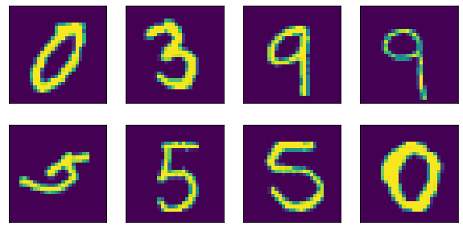

## Create a network which can take in a MNIST Data image and a Random number and output the digit from image and sum of this digit and random number entered


1. the "number" that was represented by the MNIST image, and
2. the "sum" of this number with the random number that was generated and sent as the input to the network
3. you can mix fully connected layers and convolution layers
4. you can use one-hot encoding to represent the random number input as well as the "summed" output.

### Design Multi Input Multi Output Network

1. This net should take in two inputs, 
    a. Mnist image (1, 28, 28)
    b. Random vector as one hot encoded (1, 10)
2. Output two vectors
    a. Predicted logits for MNIST digit (1, 10)
    b. Predicted logist for sum of both numbers (1, 19)

```
----------------------------------------------------------------
        Layer (type)               Output Shape         Param #
================================================================
            Conv2d-1            [-1, 7, 26, 26]              70
            Linear-2               [-1, 1, 676]           7,436
            Conv2d-3           [-1, 16, 24, 24]           1,168
         MaxPool2d-4           [-1, 16, 12, 12]               0
       BatchNorm2d-5           [-1, 16, 12, 12]              32
            Conv2d-6           [-1, 32, 10, 10]           4,640
         MaxPool2d-7             [-1, 32, 5, 5]               0
       BatchNorm2d-8             [-1, 32, 5, 5]              64
            Conv2d-9             [-1, 64, 3, 3]          18,496
           Linear-10                   [-1, 10]           5,770
           Linear-11                   [-1, 19]          10,963

```
    
#### Methodology
1. Input image is first passed on to a convolution layer
2. Input number as a one hot encoder is passed on to fc layer with output sixe equal to outputsize of first convlayer
3. Now the output from above two layers is concatinated in a way that this fc layer output becomes one of the channel
4. Further convolution is performed
5. In the output just bfore the last layer the output from previous layer is flattered and fed to linear layer with respective output.

### Dataset Creation
Here we have created a custom dataset, whch spits four values image, im_label, random_number, sum \[(1, 28, 28), (1, 1), (1, 19), (1, 1) \]

1. Download Raw dataset from MNIST website
2. Define a cutom dataset function
3. Load dataset as pandas dataframe
4. Create a data list from dataframe with these pixels and reshape them to (28, 28, 1)
5. Add function __getitem__ , this function will first load image from list, generate a new random number, create onehot vctor for that and then return them

### Load Dataset
1. Split dataset into train and test (80/20)
2. Create Loaded with respective splits and enable shuffle

#### Visualize Dataset
Print some random samples to see how images from our dataset looks like



### Training
1. Define train loop
2. Define test loop

#### Loss Calculation 
In out backpropogation we are using **negative log likelihood loss**. `nll_loss`, _`F.nll_loss`_  for a multi-class classification use case the model output is expected to contain log probabilities (applied F.log_softmax as the last activation function on the output) and have the shape \[batch_size, nb_classes\]. The target should be a LongTensor in the shape \[batch_size\] and should contain the class indices in the range \[0, nb_classes-1\].
For More Details Refer [Here](https://medium.com/@bhardwajprakarsh/negative-log-likelihood-loss-why-do-we-use-it-for-binary-classification-7625f9e3c944)

### Training Logs

```
Using Device: cuda
Epochs: 10
Lr: 0.0005
Max Lr: 0.001
Batch Size: 64


Epoch: 01
	   Learning Rate: 0.000040
	            Time: 0m 7s
	    I Train Loss: 0.618901     |  R Train Loss: 2.533642
	I Train Accuracy: 48029/56000  |  Percent: 86%
	R Train Accuracy:  5919/56000  |  Percent: 11%
	     I Val. Loss: 0.114003     |  R Val. Loss: 2.386915
	  I Val Accuracy: 13562/14000  |  Percent: 97%
	  R Val Accuracy:  1541/14000  |  Percent: 11%
Epoch: 02
	   Learning Rate: 0.000360
	            Time: 0m 6s
	    I Train Loss: 0.095886     |  R Train Loss: 1.979420
	I Train Accuracy: 54439/56000  |  Percent: 97%
	R Train Accuracy: 13817/56000  |  Percent: 25%
	     I Val. Loss: 0.090247     |  R Val. Loss: 1.202095
	  I Val Accuracy: 13583/14000  |  Percent: 97%
	  R Val Accuracy:  7678/14000  |  Percent: 55%
Epoch: 03
	   Learning Rate: 0.000680
	            Time: 0m 6s
	    I Train Loss: 0.077516     |  R Train Loss: 0.514355
	I Train Accuracy: 54690/56000  |  Percent: 98%
	R Train Accuracy: 47342/56000  |  Percent: 85%
	     I Val. Loss: 0.058659     |  R Val. Loss: 0.211830
	  I Val Accuracy: 13735/14000  |  Percent: 98%
	  R Val Accuracy: 13187/14000  |  Percent: 94%
Epoch: 04
	   Learning Rate: 0.001000
	            Time: 0m 6s
	    I Train Loss: 0.057481     |  R Train Loss: 0.151642
	I Train Accuracy: 55044/56000  |  Percent: 98%
	R Train Accuracy: 53611/56000  |  Percent: 96%
	     I Val. Loss: 0.051806     |  R Val. Loss: 0.117659
	  I Val Accuracy: 13758/14000  |  Percent: 98%
	  R Val Accuracy: 13538/14000  |  Percent: 97%
Epoch: 05
	   Learning Rate: 0.000857
	            Time: 0m 6s
	    I Train Loss: 0.041209     |  R Train Loss: 0.101974
	I Train Accuracy: 55290/56000  |  Percent: 99%
	R Train Accuracy: 54353/56000  |  Percent: 97%
	     I Val. Loss: 0.042700     |  R Val. Loss: 0.079670
	  I Val Accuracy: 13807/14000  |  Percent: 99%
	  R Val Accuracy: 13677/14000  |  Percent: 98%
Epoch: 06
	   Learning Rate: 0.000714
	            Time: 0m 7s
	    I Train Loss: 0.034248     |  R Train Loss: 0.081467
	I Train Accuracy: 55390/56000  |  Percent: 99%
	R Train Accuracy: 54674/56000  |  Percent: 98%
	     I Val. Loss: 0.039359     |  R Val. Loss: 0.077836
	  I Val Accuracy: 13838/14000  |  Percent: 99%
	  R Val Accuracy: 13691/14000  |  Percent: 98%
Epoch: 07
	   Learning Rate: 0.000571
	            Time: 0m 7s
	    I Train Loss: 0.027736     |  R Train Loss: 0.064755
	I Train Accuracy: 55508/56000  |  Percent: 99%
	R Train Accuracy: 54929/56000  |  Percent: 98%
	     I Val. Loss: 0.035879     |  R Val. Loss: 0.067051
	  I Val Accuracy: 13839/14000  |  Percent: 99%
	  R Val Accuracy: 13706/14000  |  Percent: 98%
Epoch: 08
	   Learning Rate: 0.000428
	            Time: 0m 7s
	    I Train Loss: 0.021627     |  R Train Loss: 0.054633
	I Train Accuracy: 55634/56000  |  Percent: 99%
	R Train Accuracy: 55060/56000  |  Percent: 98%
	     I Val. Loss: 0.032926     |  R Val. Loss: 0.065013
	  I Val Accuracy: 13852/14000  |  Percent: 99%
	  R Val Accuracy: 13720/14000  |  Percent: 98%
Epoch: 09
	   Learning Rate: 0.000286
	            Time: 0m 7s
	    I Train Loss: 0.016806     |  R Train Loss: 0.045707
	I Train Accuracy: 55695/56000  |  Percent: 99%
	R Train Accuracy: 55248/56000  |  Percent: 99%
	     I Val. Loss: 0.030859     |  R Val. Loss: 0.056470
	  I Val Accuracy: 13858/14000  |  Percent: 99%
	  R Val Accuracy: 13761/14000  |  Percent: 98%
Epoch: 10
	   Learning Rate: 0.000143
	            Time: 0m 7s
	    I Train Loss: 0.013922     |  R Train Loss: 0.039564
	I Train Accuracy: 55760/56000  |  Percent: 100%
	R Train Accuracy: 55328/56000  |  Percent: 99%
	     I Val. Loss: 0.029102     |  R Val. Loss: 0.048545
	  I Val Accuracy: 13867/14000  |  Percent: 99%
	  R Val Accuracy: 13791/14000  |  Percent: 99%
```