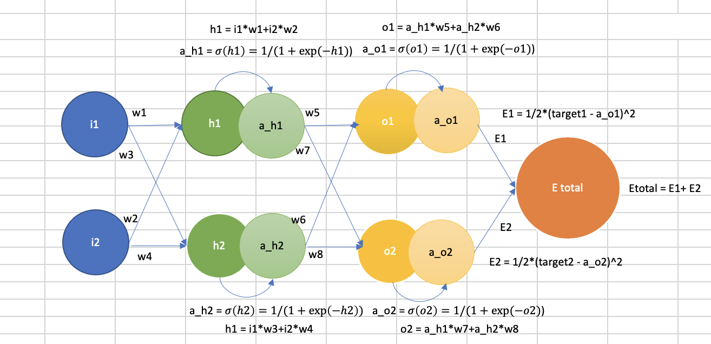
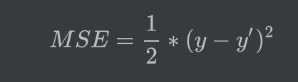
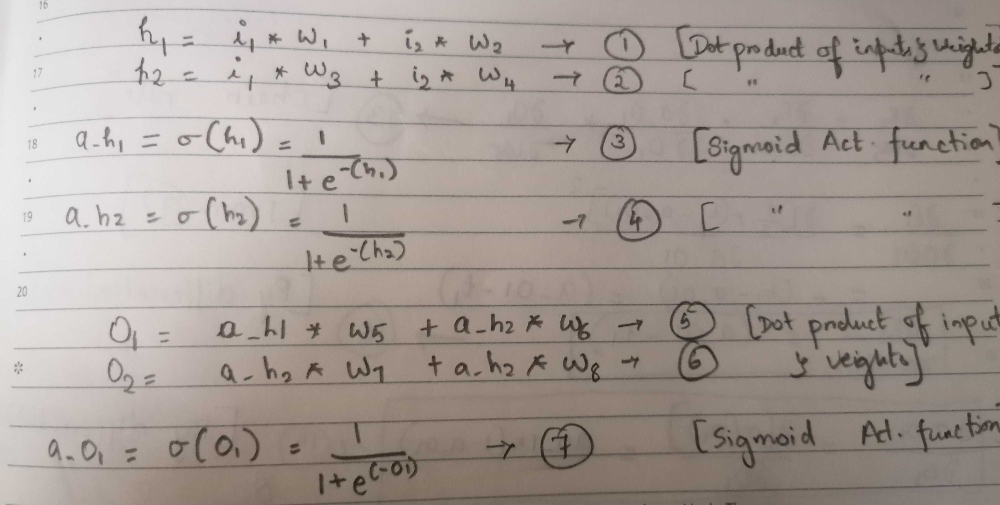
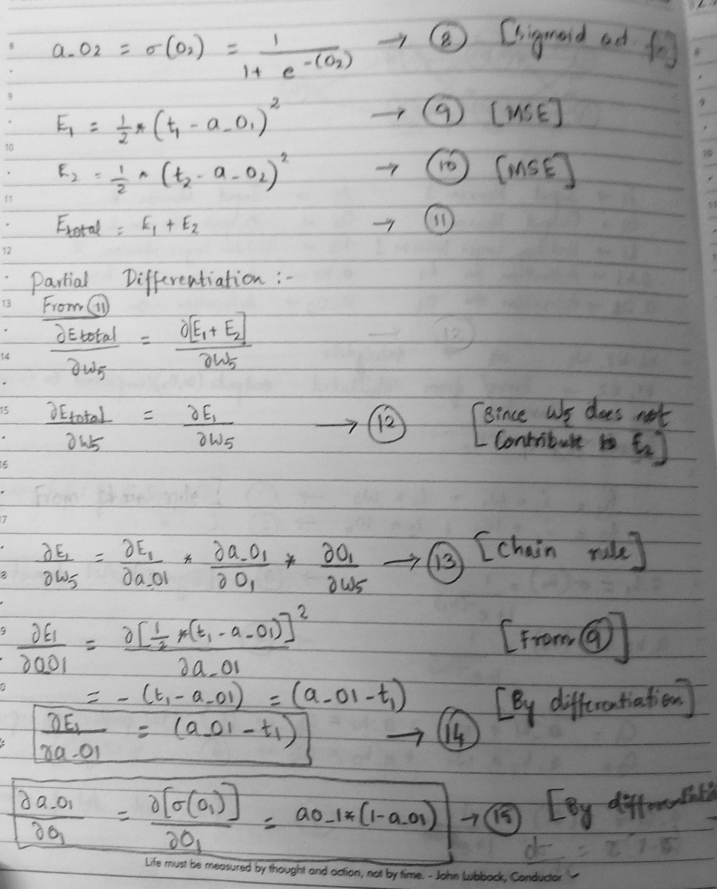
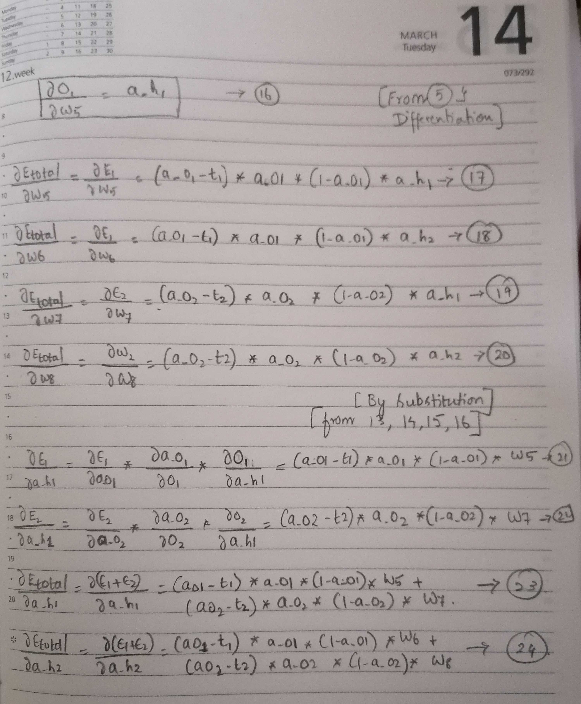
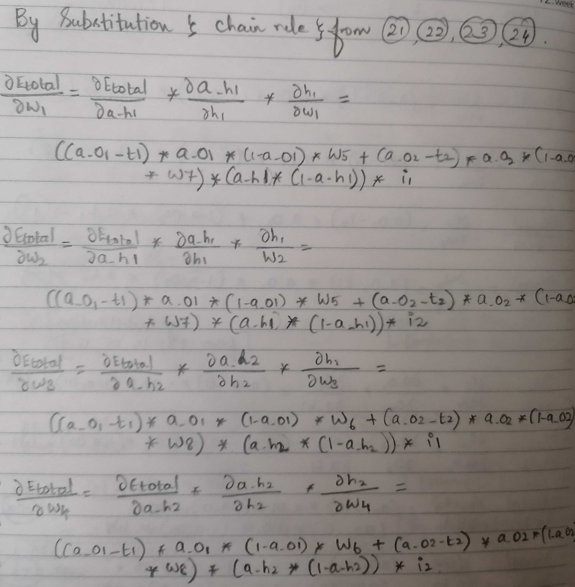
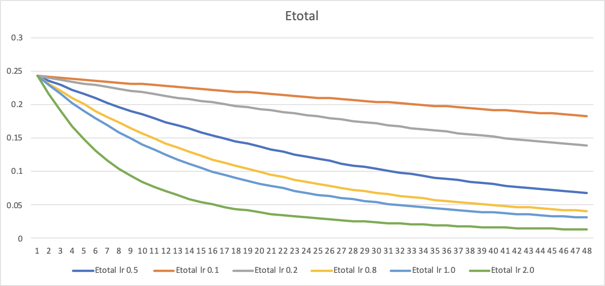
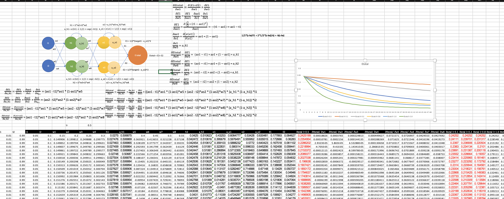

# Forward and Backward Propagation

This document will take you the neural network components, layers, functions and operations performed in a basic neural network. 

### Contributors:
* [Ammar Adil](https://github.com/adilsammar)
* [Krithiga](https://github.com/BottleSpink)
* [Shashwat Dhanraaj](https://github.com/sdhanraaj12)
* [Srikanth Kandarp](https://github.com/Srikanth-Kandarp)

## Table of Contents:

* Excel Sheet Link
* Network Architecture
* Components
* Layers
* Activation Function
* Error
* Derivations
* Steps in forward propagation
* Steps in Backward Propagation
* Results & Inference
* Screenshot

### Excel Sheet Link:

https://docs.google.com/spreadsheets/d/1uMt9n0yHHqeoY4aUZaf1T6F4ZBFQX_gP7zskxvwo9qo/edit?usp=sharing 

### Network Architecture:

### Components:
* i1, i2 -> Input Neurons
   o1, o2 -> Output Neurons  
   t1, t2 -> Target values    
   h1, h2 -> Hidden layer Neurons  
   a_h1, a_h2 -> Activation on h1, h2       
   a_o1, a_o2  -> Activation on o1, o2 
   E1, E2 -> Error calculated between target values and outputs 

* Weights: w1, w2, w3, w4, w5, w6, w7, w8 -> Weights of the Neural Network

### Layers:

* Input Layer  - 2 Input Neurons
* Hidden Layer - 1 hidden layer with 2 neurons
* Output Layer - 2 Output Neurons (For eg: binary -> yes and no)

### Activation Function:

We have used sigmoid activation function for this neural network:

### Error:

* Etotal = E1 + E2 

* Mean Square Error (MSE): 

### Derivations:

#### Partial derivative: 
   In simple terms, we differentiate with respect to one variable and we keep others as constant. This is used in backpropagation. For example: z = x+y, here the rate of change of x over z, irrespective of y.

#### Chain rule:
   In simpler terms, we can see that as parsing through layers. We first solve for one layer and move on to the next and next. For example: z= (x+y)^2, here the square is our first layer, we solve for that and move on to the (x+y) layer which is our second layer. If we had a co-efficient for x, then that would be solved next. 

### Steps in forward propagation:

* Weights are initialized with random values. 
* Dot products will be calculated at each stage between weights and the inputs (Previous layer's outputs for hidden and output layer)
* The activation functions are applied at each stage 
* Error is calculated between the target and the output of the last layer using MSE

### Steps in Backward Propagation:

* Partial differentiation is done at every stage. From error to the input layer using chain rule
* In backward propagation, though our weights are initially randomized, we let the network to learn the weights values by updating them after each step

   
   
* The backpropagation step provides an implementation of the chain rule
* And the error values are calculated with the new updated weights
* We have repeated the same steps for different learning rates and observations are recorded

### Results & Inference:

* For different learning rates, the forward and backward propagation are done and tabulated below
* When the learning rate is 2, the error seems to be low. The higher the learning rate, the network converged faster and less error is observed in this case. (Output nearer to the true values)

### Screenshot:

(Excel sheet is also attached.)

