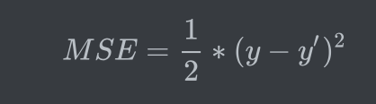
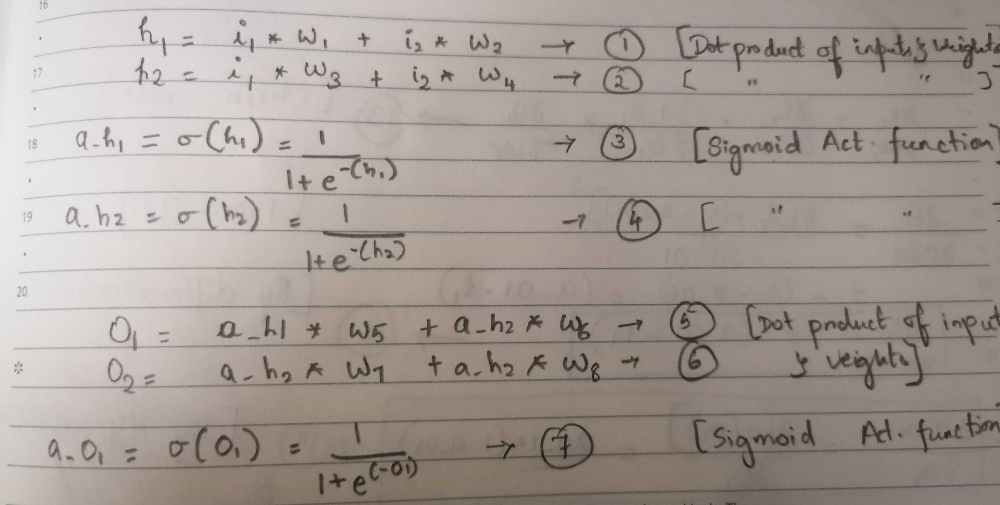
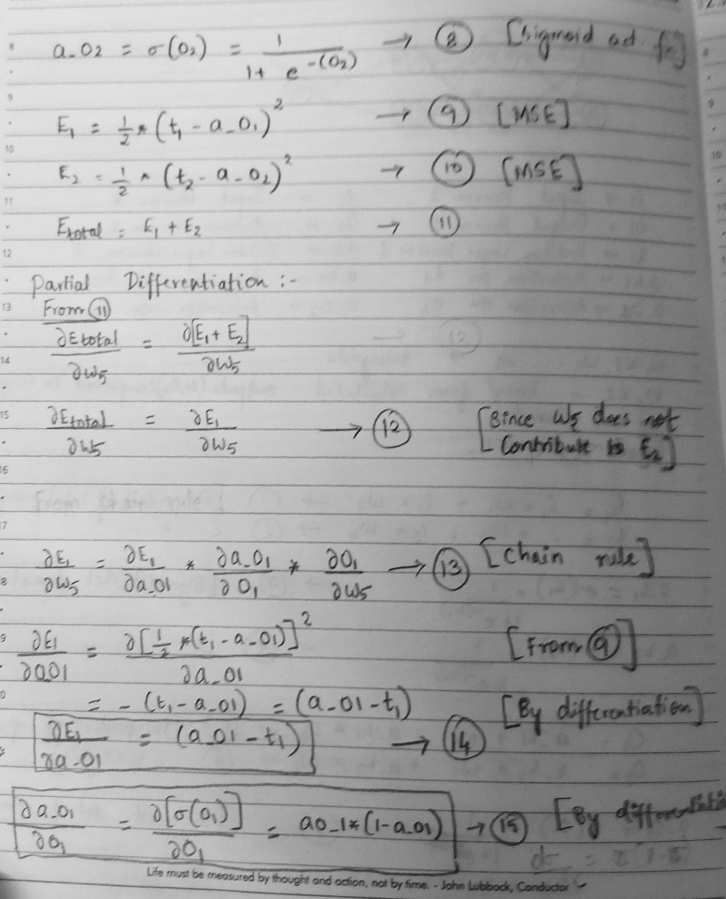
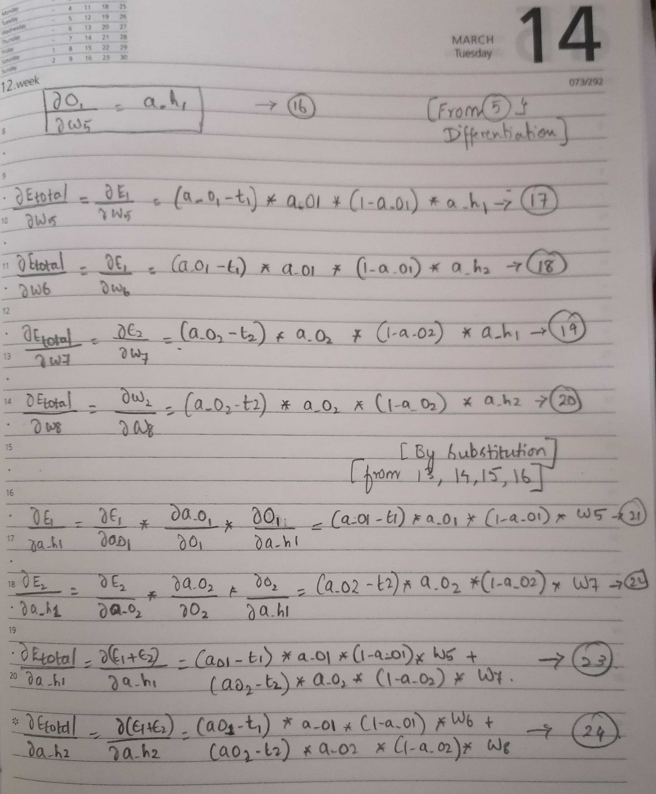
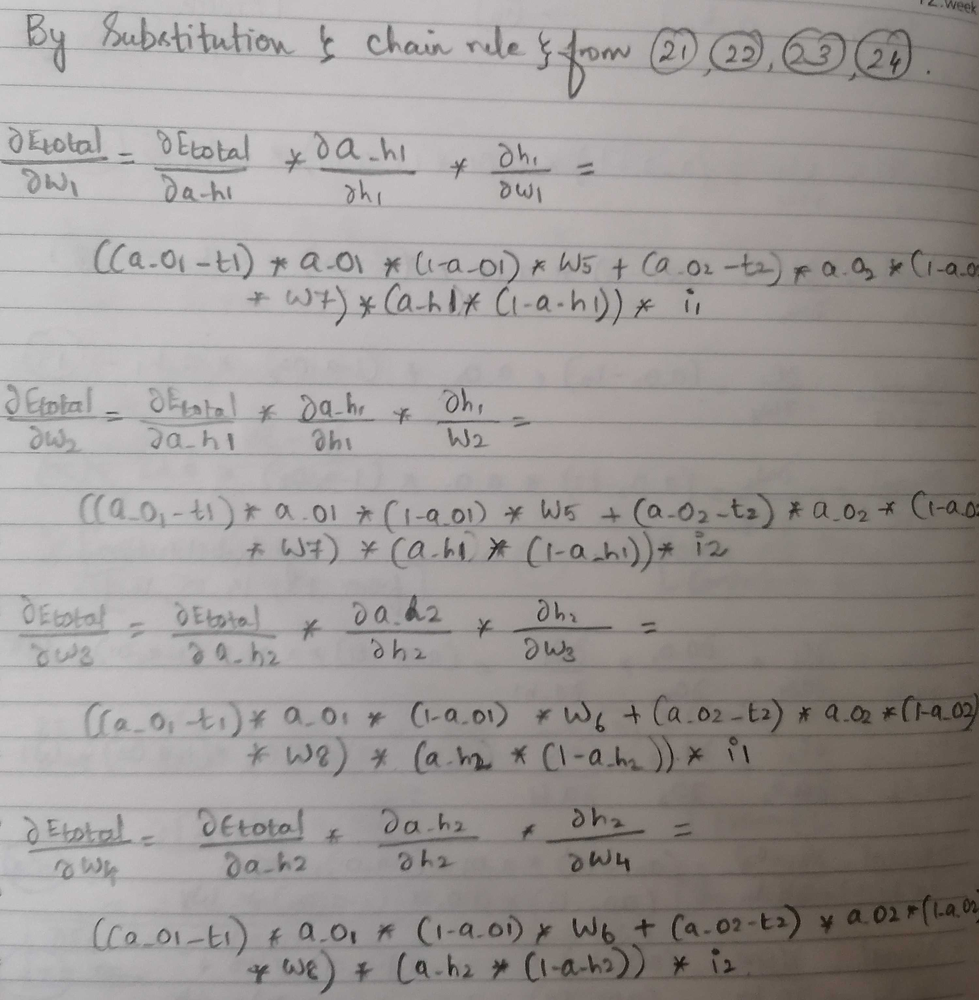
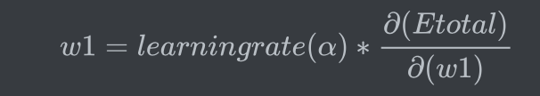
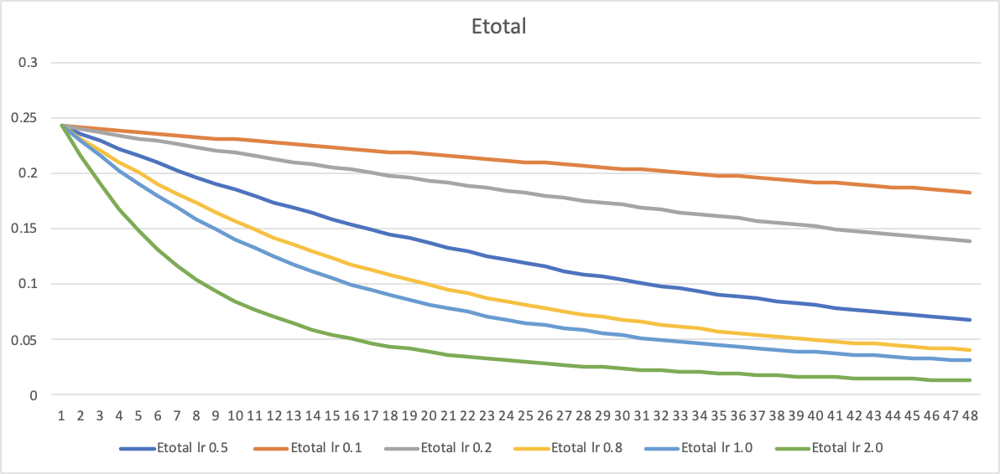
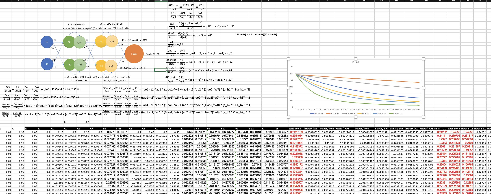

# Forward and Backward Propagation

This document will take you the neural network components, layers, functions and operations performed in a basic neural network.

### Contributors:
* [Ammar Adil](https://github.com/adilsammar)
* [Krithiga](https://github.com/BottleSpink)
* [Shashwat Dhanraaj](https://github.com/sdhanraaj12)
* [Srikanth Kandarp](https://github.com/Srikanth-Kandarp)

### Components:
* i1, i2 -> Input Neurons
   o1, o2 -> Output Neurons  
   t1, t2 -> Target values    
   h1, h2 -> Hidden layer Neurons  
   a_h1, a_h2 -> Activation on h1, h2       
   a_o1, a_o2  -> Activation on o1, o2 
   E1, E2 -> Error calculated between target values and outputs 

* Weights: w1, w2, w3, w4, w5, w6, w7, w8 -> Weights of the Neural Network

### Layers:

* Input Layer  - 2 Inputs
* Hidden Layer - 1 hidden layer with 2 neurons
* Output Layer - 2 Outputs

### Activation Function:

We have used sigmoid activation function for this neural network:

### Error:

* Etotal = E1 + E2 

* Mean Square Error (MSE): 

### Derivations:

### Steps in forward propagation:

* Weights are initialized with random values. 
* Dot products will be calculated at each stage between weights and the inputs (Previous layer's outputs for hidden and output layer)
* The activation functions are applied at each stage
* Error is calculated between the target and the output of the last layer using MSE

### Steps in Backward Propagation:

* Partial differentiation is done at every stage. From error to the input layer using chain rule

* For the backward propagation, the weights values needs to be updated by 

   
   
* And the error values are calculated with the new updated weights

### Results & Inference:

* For different learning rates, the forward and backward propagation are done and tabulated below

* When the learning rate is 2, the error seems to be low. The higher the learning rate, the network converged faster and less error is observed in this case. (Output nearer to the true values)

### Screenshot:

(Excel sheet is also attached.)

