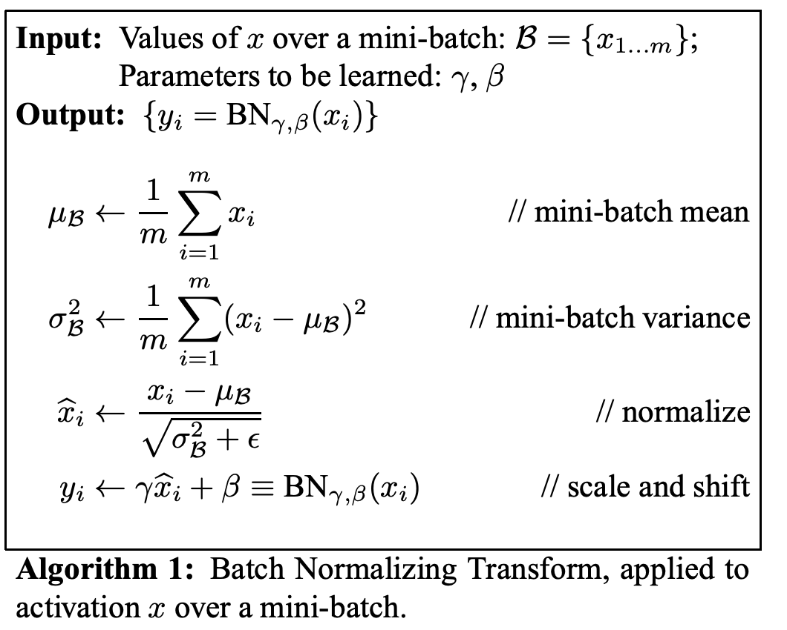
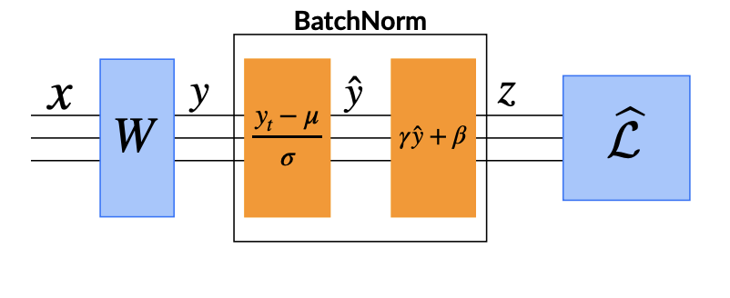
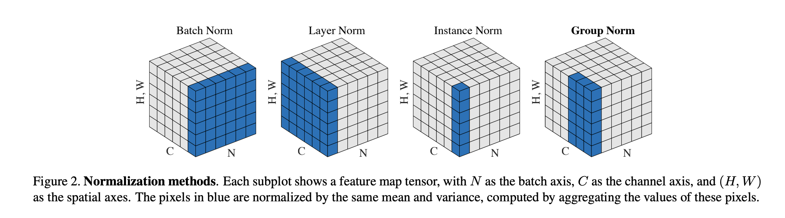
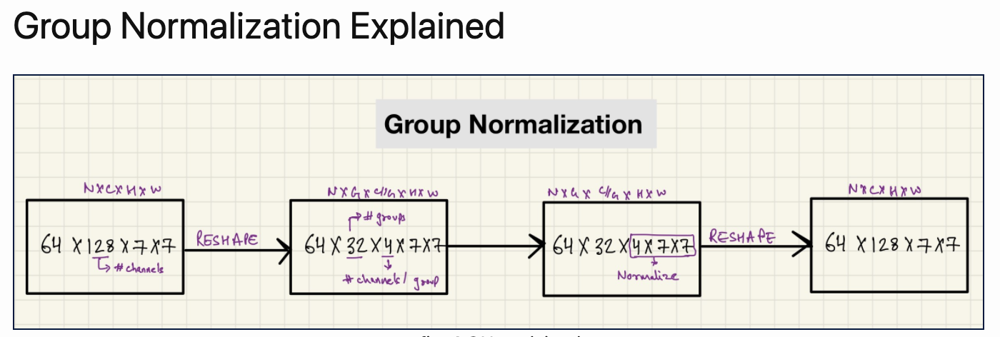

# Assignment 6 

## Table of Contents:

* Contributors
* Code Explanation
* Normalization Techniques Explained
* L1
* Inferences + Graphs
* Visualization for misclassified predictions
* References

## Contributors:

* [Ammar Adil](https://github.com/adilsammar)
* [Krithiga](https://github.com/BottleSpink)
* [Shashwat Dhanraaj](https://github.com/sdhanraaj12)
* [Srikanth Kandarp](https://github.com/Srikanth-Kandarp)

## Code Explanation:

The codebase has been modularized and we have kept the below in separate .py files

* Dataset loader 
* Model Architecture
* Data Transformations
* Backpropagation
* LR Scheduler
* Visualization
* Utils 

<To include code explanations>

[Link where the above files are available](https://github.com/adilsammar/woolly-of-cv/tree/main/assets/mnist/mnist)

The above files are used in the [Notebook](https://github.com/adilsammar/woolly-of-cv/blob/main/assets/mnist/notebook/MNIST_ALBUMENTATION_CONSOLIDATED.ipynb)

## Normalization Techniques Explained:
  
  * What is Normalization: 
  
  Input data comes in different ranges and scales. Normalization helps to change their ranges and scales to bring uniformity to data. Eg: Input images can be standardized to range of [0,255] or [0,1]. For a grayscale image, '0' being black colour while '255' being white colour. 
  
  To convert a [-500, 1000] to 0-255. 
  
  * Step 1: -500 can be brought to 0 by adding 500. That brings us to [0,1500]
  * Step 2: Bring [0,1500] to [0,255] -> 255/1500.
  
  Normalization can also be defined as a transformation, which ensures that the transformed data has certain statistical properties like Mean close to 0, std.dev close to 1 and so on. 
  
  The below given diagram shows different transformation operations that can be performed on our data:
  
  * Centering: Ensures that the normalized output has a zero-mean property
  * Scaling: Ensures that the normalized output has a unit-variance property
  * Standardizing: Combines centering and scaling and ensures that the normalized output has zero-mean and unit-variance properties
  * Whitening: Ensures that the normalized output has a spherical Gaussian distribution
  * Decorrelating: Ensures that the correlation between different dimensions of the normalized output is zero 
  
  Source: https://arxiv.org/pdf/2009.12836.pdf
  
   

 Normalization can be applied at different levels. Below, we will take a look at the 3 normalization techniques.
  
### Batch Normalization:
  
  * What is Batch Normalization? 
  
  Making normalization a part of the model architecture and performing the normalization for each training mini-batch. 
  
  Calculations for Batch Norm:
  
  
  
  
  
  * Why does it work? 
  
  Batch Normalization has been proved to be of help to reduce Internal Covariate Shift. 
  
  * What is Covariate Shift?
  
  The change in the distributions of layers’ inputs presents a problem because the layers need to continuously adapt to the new distribution. When the input distribution to a learning system changes, it is said to experience covariate shift.
  
   A layer with an activation function with u as the layer input, the weight matrix W and bias vector b. The model learns w,b at every backpropagation step making the gradient flowing down to u leading them to vanish and also it leads to slow convergence as the network depth increases. Also, the gradients with respect to the weights in one layer are highly dependent on the outputs of the neurons in the previous layer especially if these outputs change in a highly correlated way.The nonlinear inputs not remaining stable at different parts of the training is referred to as Covariate shift. By carefully initializing and by ensurinng small learning rate could solve this problem. However, this can also be solved by making the inputs to the activation more stable. 
  
  * Other advantages of BN:
  
  1. Batch Normalization enables higher learning rates
  2. Batch Normalization regularizes the model

### Layer Normalization:
  
  * What is Layer Normalization?
  
  Estimates the normalization statistics from the summed inputs to the neurons within a hidden layer so the normalization does not introduce any new dependencies between training cases as in the case of BN. For batch normalization, input values of the same neuron from different images in one mini batch are normalized whereas in layer normalization, input values for different neurons in the same layer are normalized without consideration of mini batch.
  
  * Why is it needed?
  
      * Originally introduced as BN was hard to apply to recurrent neural networks. 
      * Used in Transformers

### Group Normalization:
  
  * What is Group Normalization?
  
      Group Normalization divides the channels into groups and computes within each group the mean and variance for normalization. GN’s computation is independent of batch sizes, and its accuracy is stable in a wide range of batch sizes.
  
  Source: https://arxiv.org/pdf/1803.08494.pdf
  
  
  
  * Group Normalization Calculation:
  
  
  
  Instead of normalizing accross the batch dimension, GN normalizes accross the groups.
  
  * Do we need this inspite of batch normalization?
  
      BN’s error increases rapidly when the batch size becomes smaller, caused by inaccurate batch statistics estimation. This is seen as a drawback in other CV tasks such as detection, segmentation, and video, which require small batches constrained by memory consumption.
 
* Other normalization techniques includes Instance Normalization, Weights Normalization

## L1:
  
## Inferences + Graphs:
  
  
  
  
## Visualization for misclassified predictions:
 
  
  
  
  
## References:
  
  * https://arxiv.org/pdf/2009.12836.pdf
  * http://proceedings.mlr.press/v37/ioffe15.pdf
  * https://arxiv.org/pdf/1803.08494.pdf
  * https://arxiv.org/pdf/1502.03167.pdf
  

